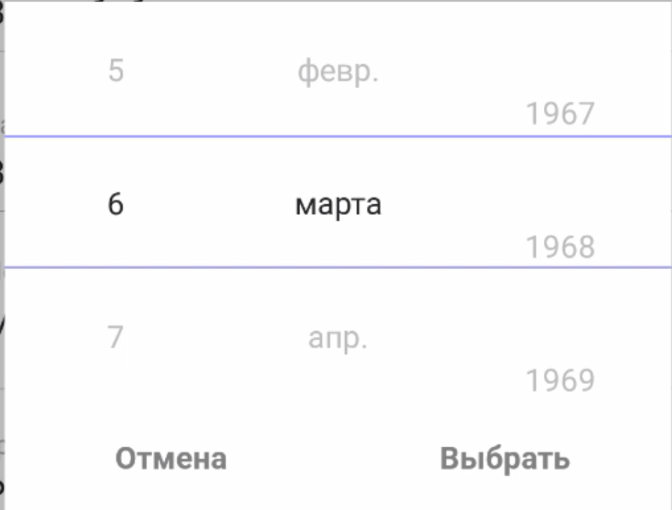

# rn-wheel-picker-js

## Example usage (data picker)

### Preview



### Code

```js
import React from "react";
import { Text, View, StyleSheet, Modal } from "react-native";
import { RnWheelPickerJSJS } from "rn-wheel-picker";

const Picker = ({ data, selected, label, changeState }) => (
  <RnWheelPickerJSJS
    data={data}
    selectedIndex={selected}
    onValueChange={(changeData, selectedIndex) => {
      if (label === "month") {
        changeState(label, selectedIndex + 1);
      } else {
        changeState(label, changeData);
      }
    }}
    optionsWrapperWidth={100}
    optionHeight={60}
    highlightBorderColor="#8F8CFF"
    highlightBorderWidth={1}
    activeItemColor="#222121"
    itemColor="#B4B4B4"
  />
);

export class DatePicker extends React.Component {
  constructor(props) {
    super(props);
    const maxYear = props.maxYear ? props.maxYear : 2100;

    this.years = this.generateArrayFromRange(1940, maxYear);
    this.months = [
      "янв.",
      "февр.",
      "марта",
      "апр.",
      "мая",
      "июня",
      "июля",
      "авг.",
      "сент.",
      "окт.",
      "нояб.",
      "дек."
    ];
    this.state = {
      date: {
        day: props.day,
        month: props.month,
        year: props.year
      }
    };
  }

  componentWillReceiveProps(nextProps) {
    if (!this.props.visible && nextProps.visible) {
      this.setState({
        date: {
          day: this.props.day,
          month: this.props.month,
          year: this.props.year
        }
      });
    }
  }

  changeState = (label, value) => {
    this.setState(({ date }) => {
      return {
        date: {
          ...date,
          [label]: value
        }
      };
    });
  };

  getValidYearIndex = () => {
    const index = this.years.findIndex(item => item == this.state.date.year);

    if (index !== -1) {
      return index;
    }

    this.setState(({ date }) => {
      return {
        date: {
          ...date,
          year: this.years[this.years.length - 1]
        }
      };
    });

    return this.years.length - 1;
  };

  getDayForMonth = () => {
    const { year, month } = this.state.date;

    return new Date(year, month, 0).getDate();
  };

  chooseDate = () => {
    this.props.onChoose(this.state.date);
  };

  generateArrayFromRange(start, finish) {
    return Array.apply(null, new Array(finish - start + 1)).map(
      (_, i) => start + i
    );
  }

  getValidDay = () => {
    const daySelected = parseInt(this.state.date.day) - 1;

    if (this.days[daySelected]) {
      return daySelected;
    }

    this.setState(({ date }) => {
      return {
        date: {
          ...date,
          day: this.days[this.days.length - 1]
        }
      };
    });

    return this.days[this.days.length - 1];
  };

  render() {
    const yearIndex = this.getValidYearIndex();
    const maxDays = this.getDayForMonth();
    const days = this.generateArrayFromRange(1, maxDays);

    this.days = days;

    return (
      <Modal
        transparent
        visible={this.props.visible}
        onRequestClose={this.props.onClose}
      >
        <View style={styles.wrapper}>
          <View style={styles.pickerWrapper}>
            <Picker
              data={this.days}
              selected={this.getValidDay()}
              changeState={this.changeState}
              label="day"
            />
            <Picker
              data={this.months}
              selected={this.state.date.month - 1}
              changeState={this.changeState}
              label="month"
            />
            <Picker
              data={this.years}
              selected={yearIndex}
              changeState={this.changeState}
              label="year"
            />
          </View>
          <View style={styles.textWrapper}>
            <Text style={styles.text} onPress={this.props.onClose}>
              Отмена
            </Text>
            <Text style={styles.text} onPress={this.chooseDate}>
              Выбрать
            </Text>
          </View>
        </View>
      </Modal>
    );
  }
}

const styles = StyleSheet.create({
  pickerWrapper: {
    alignItems: "center",
    justifyContent: "center",
    flexDirection: "row"
  },
  wrapper: {
    alignItems: "center",
    flex: 1,
    backgroundColor: "rgba(0, 0, 0, 0.3)",
    justifyContent: "center"
  },
  text: {
    padding: 15,
    backgroundColor: "#fff",
    width: 150,
    textAlign: "center",
    fontWeight: "bold"
  },
  textWrapper: {
    flexDirection: "row"
  }
});
```
